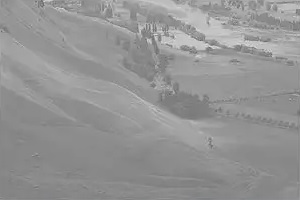
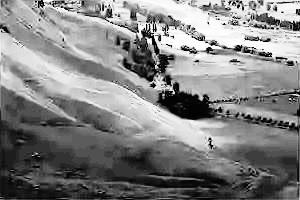
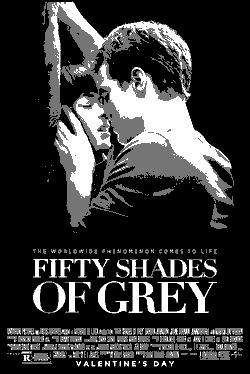

# Image Representations, Intensity Transformations & Quantization
 
<br>Histogram Equalization<br><br>
 
<br>Optimal Quantization

## Overview
This project covers:
* Loading grayscale and RGB image representations.
* Displaying figures and images.
* Transforming RGB color images back and forth from the YIQ color space.
* Performing intensity transformations: histogram equalization.
* Performing optimal quantization.

I developed it during the course [Image Processing - 67829](https://moodle2.cs.huji.ac.il/nu17/course/view.php?id=67829), taught at the Hebrew University by Prof. Shmuel Peleg during spring semester of 2017/18.
This code was my submission for [exercise #1](image-processing-67829-ex1.pdf) .

## Setup
Clone the repository, then create a local [virtual environment](https://www.geeksforgeeks.org/python-virtual-environment/#:~:text=A%20virtual%20environment%20is%20a,of%20the%20Python%20developers%20use.):
```bash
$ virtualenv -p /usr/bin/python3 venv
```

Activate the virtual environment with:
```bash
$ source venv/bin/activate
(venv)$
```

Install ```requirements.txt``` using pip:
```bash
(venv)$ pip install -r requirements.txt
```

## Usage
By default, run it with:
```bash
(venv)$ python demo.py
```
Refer to [optimal_quantization.py](optimal_quantization.py) and [histogram_equalization.py](histogram_equalization.py) for further details.